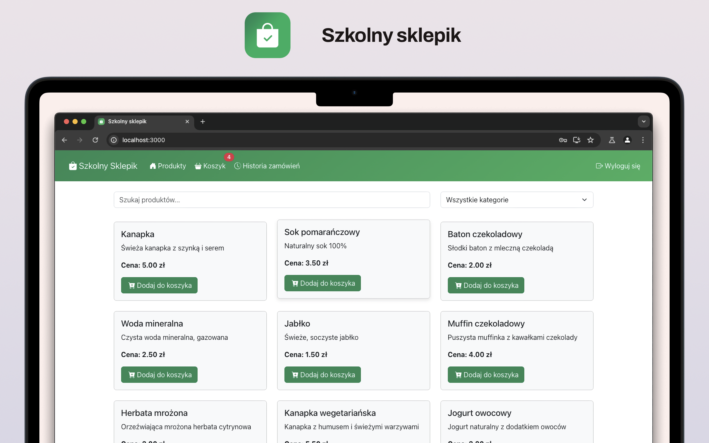
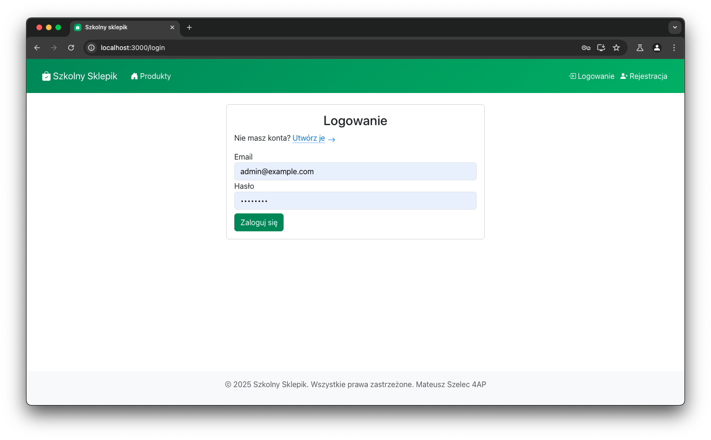
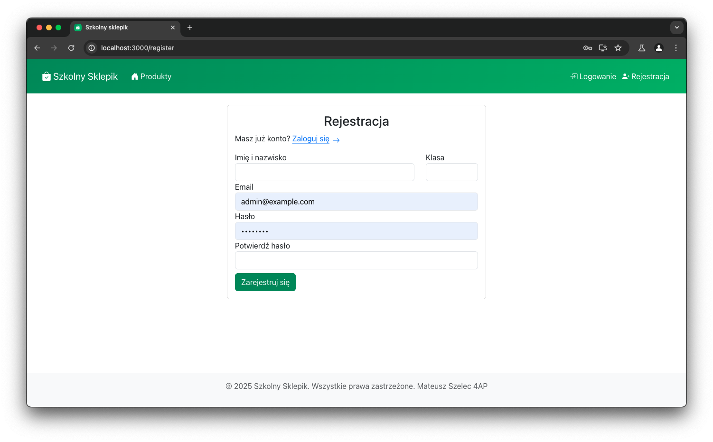
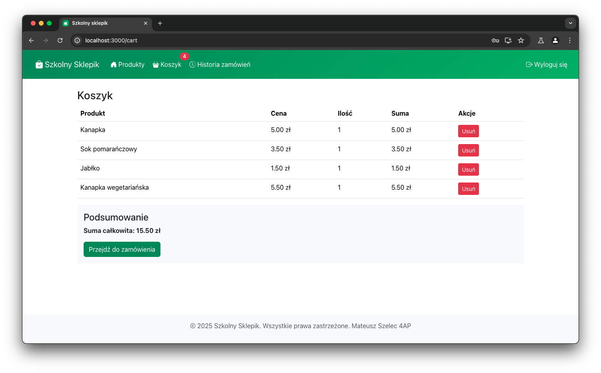
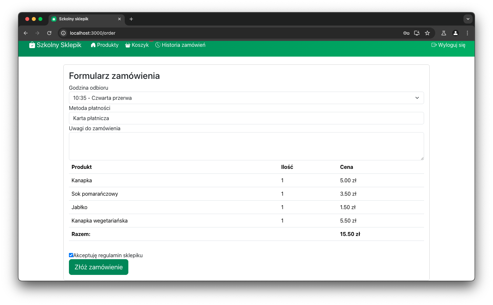
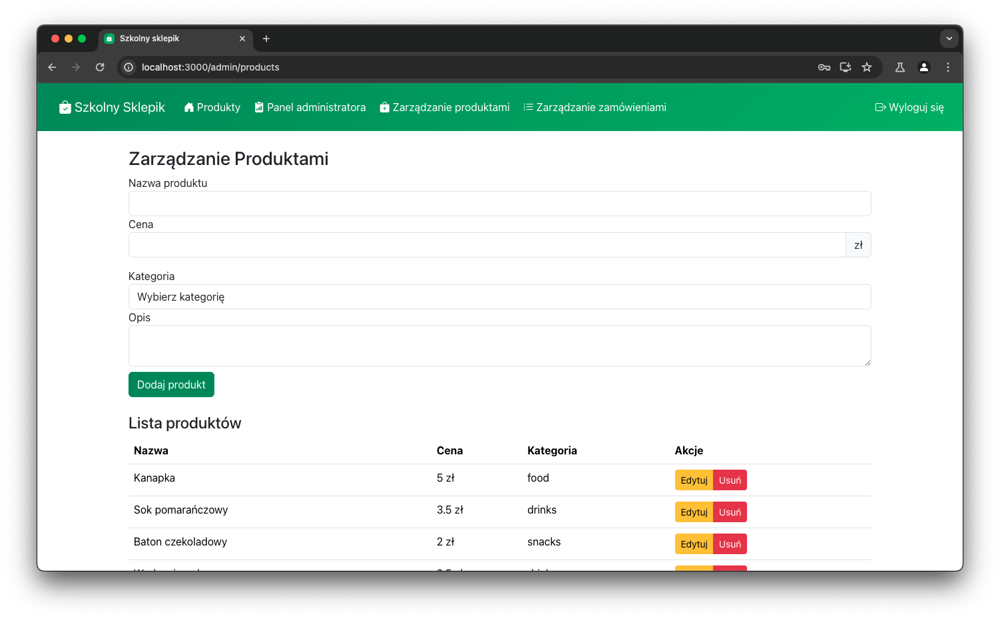

<div align="center">
    
    <h1>Szkolny Sklepik</h1>
</div>

# 


Aplikacja internetowa oparta na React, służąca do zarządzania sklepikiem szkolnym. Umożliwia uczniom zamawianie jedzenia i napojów na konkretne przerwy, a administratorom zarządzanie produktami i zamówieniami.

## 🌟 Funkcjonalności


### Dla Uczniów/Użytkowników
- Przeglądanie dostępnych produktów z wyszukiwaniem i filtrowaniem kategorii
- Dodawanie produktów do koszyka
- Składanie zamówień na konkretne przerwy
- Przeglądanie historii zamówień
- Aktualizacje koszyka w czasie rzeczywistym

### Dla Administratorów
- Kompleksowy panel administracyjny ze statystykami
- Zarządzanie produktami
- Zarządzanie zamówieniami z aktualizacją statusów
- Monitorowanie sprzedaży

## 🔧 Technologie

- **Framework Frontend:** React.js
- **Routing:** React Router v6
- **Stylizacja:** Bootstrap 5 + Bootstrap Icons
- **Zarządzanie Stanem:** React Component State
- **Uwierzytelnianie:** Prosty system email/hasło

## 📦 Struktura Projektu

```
src/
├── components/
│   ├── admin/
│   │   ├── AdminDashboard.js    # Panel administratora
│   │   ├── OrderManager.js      # Zarządzanie zamówieniami
│   │   └── ProductManager.js    # Zarządzanie produktami
│   ├── auth/
│   │   ├── Login.js             # Logowanie
│   │   └── Register.js          # Rejestracja
│   ├── layout/
│   │   ├── Footer.js            # Stopka
│   │   └── Navbar.js            # Pasek nawigacji
│   └── user/
│       ├── Cart.js              # Koszyk
│       ├── OrderForm.js         # Formularz zamówienia
│       ├── OrderHistory.js      # Historia zamówień
│       ├── ProductCard.js       # Karta produktu
│       └── ProductList.js       # Lista produktów
└── App.js                       # Główny komponent aplikacji
```

## 🚀 Instalacja i Uruchomienie

1. Klonowanie repozytorium
```bash
git clone https://github.com/ITAMOWSKI/Szkolny-Sklepik
cd szkolny-sklepik
```

2. Instalacja zależności
```bash
npm install
```

3. Uruchomienie serwera deweloperskiego
```bash
npm start
```

## 🔐 Uwierzytelnianie

Aplikacja zawiera testowy system uwierzytelniania z dwoma predefiniowanymi użytkownikami:

- Administrator:
    - Email: admin@example.com
    - Hasło: admin123

- Zwykły Użytkownik:
    - Email: user@example.com
    - Hasło: user123

## 💡 Szczegóły Implementacji

### Zarządzanie Produktami
- Produkty przechowują następujące informacje:
    - Nazwa
    - Cena
    - Kategoria
    - Opis
- Dostępne kategorie: jedzenie, napoje, przekąski, owoce, nabiał

### Koszyk
- Aktualizacje w czasie rzeczywistym
- Ograniczenia ilościowe (max 10 sztuk na produkt)
- Obliczanie sumy zamówienia
- Możliwość usuwania produktów

### System Zamówień
- Wybór przerwy na odbiór
- Wybór metody płatności (gotówka/karta)
- Uwagi do zamówienia
- Wymagana akceptacja regulaminu
- Śledzenie statusu zamówienia

### Panel Administratora
- Przegląd ostatnich zamówień
- Statystyki produktów
- Zarządzanie statusami zamówień
- Operacje CRUD na produktach

## 🔄 Zarządzanie Stanem

Aplikacja wykorzystuje zarządzanie stanem komponentów React z następującymi głównymi obiektami stanu:

```javascript
{
    isAuthenticated: boolean,   // Stan uwierzytelnienia
    isAdmin: boolean,           // Uprawnienia administratora
    user: Object,               // Dane użytkownika
    cart: Array,                // Koszyk
    products: Array,            // Lista produktów
    orders: Array               // Lista zamówień
}
```

## 📱 Responsywność

Aplikacja jest w pełni responsywna i zoptymalizowana zarówno dla urządzeń stacjonarnych jak i mobilnych, wykorzystując system siatki i komponenty Bootstrap.

## 🛡️ Zabezpieczenia

- Chronione ścieżki administratora
- Zarządzanie stanem uwierzytelnienia
- Walidacja danych wejściowych
- Obsługa błędów

## 🎨 Interfejs Użytkownika

- Intuicyjna nawigacja
- Przejrzysty podział na kategorie
- Informacje zwrotne w czasie rzeczywistym
- Wskaźniki statusu zamówień
- Stany ładowania
- Komunikaty o błędach
- Responsywny design
- Spójna stylizacja oparta na Bootstrap

## 🔍 Wyszukiwanie i Filtrowanie

- Wyszukiwanie produktów po nazwie
- Filtrowanie po kategorii
- Filtrowanie statusów zamówień
- Filtrowanie historii zamówień

## 🌆 Galaria
<table style="border: none">
  <tr style="border: none">
    <td style="border: none"></td>
    <td style="border: none"></td>
    <td style="border: none"></td>
  </tr>
  <tr style="border: none">
    <td style="border: none"></td>
    <td style="border: none"></td>
    <td style="border: none"></td>
  </tr>
</table>

## 📄 Licencja
Ten projekt jest licencjonowany na warunkach licencji MIT - szczegóły w pliku LICENSE.

## ✍️ Autor

Mateusz Szelec
Klasa 4AP